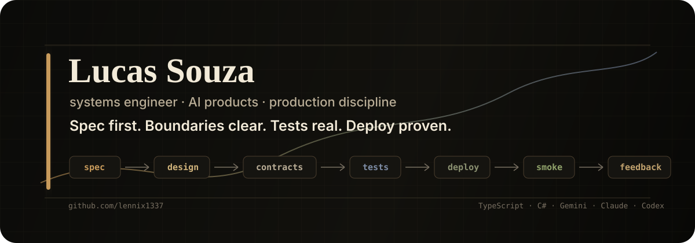

  

  <strong><a href="https://lennix1337.github.io">Enter the 3D systems profile</a></strong> 
  scroll-driven Three.js version of this profile

Programming language is a means, not the work.

The work is the spec, the system design, and the engineering fundamentals:
boundaries, contracts, failure modes, observability, and data flow.

AI is a force multiplier, not a crutch. Code is downstream.

## Now

- **DentAI**: tech lead. AI-first dental platform: RAG, Gemini, clinical assistant workflows, automation, production release flow.
- **UNIVALI**: leading academic systems team with Next.js, TypeScript, and internal platform work.

## Taste

Small interfaces. Explicit contracts. Boring deploys. Sharp feedback loops.

## Featured

- **[Genexus18MCP](https://github.com/lennix1337/Genexus18MCP)**: MCP server for GeneXus 18. Brings Claude/Cursor-style workflows to GeneXus codebases. `C#`
- **[locoChat](https://github.com/lennix1337/locoChat)**: stream-chat viewer built around a Loco endpoint gap that made public user chat mirroring possible by username. `JavaScript`

## Stack

`TypeScript` `Next.js` `React` `Node.js` `C#` `PostgreSQL` `Docker` `AWS` `GitHub Actions` `Gemini` `Claude` `Codex` `RAG`

## Reach me

- [LinkedIn](https://www.linkedin.com/in/lucaszsouza/)
- [Email](mailto:swlucas05@gmail.com)
